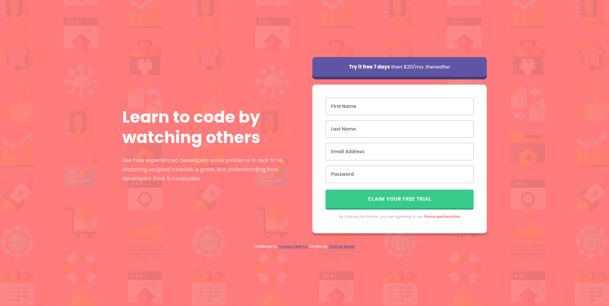

# Intro component with sign-up form

> Composant d'introduction avec formulaire d'inscription validé en TypeScript, réalisé dans le cadre d'un challenge Frontend Mentor.




**🔗 [Demo en ligne](https://front-end-mentor-intro-component-wi.vercel.app/)**

---

## 🎯 Objectif

Challenge [Frontend Mentor](https://www.frontendmentor.io/challenges/intro-component-with-signup-form-5cf91bd49edda32581d28fd1) — l'objectif était de reproduire fidèlement une interface responsive à partir d'une maquette desktop et mobile. Ce projet m'a permis de pratiquer la structuration SCSS modulaire, la mise en page avec CSS Grid et la validation de formulaire en TypeScript sans dépendance externe.

**Ce que j'ai appris :**

- Organiser un projet SCSS avec la convention BEM et des fichiers de variables séparés
- Mettre en page une interface responsive avec CSS Grid en approche mobile-first
- Valider un formulaire en TypeScript pur : typage strict, gestion des erreurs champ par champ

---

## 🛠️ Stack

[](https://html5.org)
[](https://sass-lang.com)
[](https://typescriptlang.org)
[](https://vitejs.dev)

---

## 🚀 Lancer le projet

```bash
# Cloner le dépôt
git clone https://github.com/Thomas-Bezille/FrontEnd-Mentor_Intro_component_with_sign-up_form.git
cd FrontEnd-Mentor_Intro_component_with_sign-up_form

# Installer les dépendances
npm install

# Lancer en développement
npm run dev
```

Le projet tourne sur [http://localhost:5173](http://localhost:5173).

---

## 👤 Contact

**Thomas Bezille** — Développeur web à Nantes

[](https://www.linkedin.com/in/thomas-bezille/)
[](https://github.com/Thomas-Bezille)
